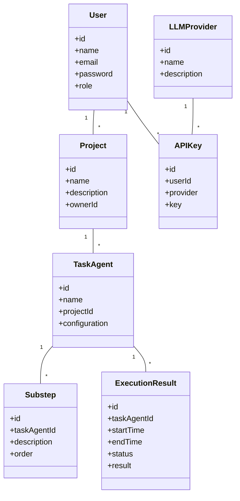
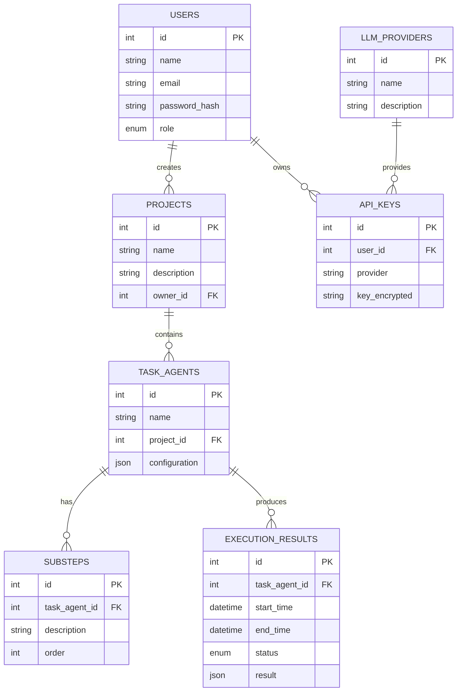
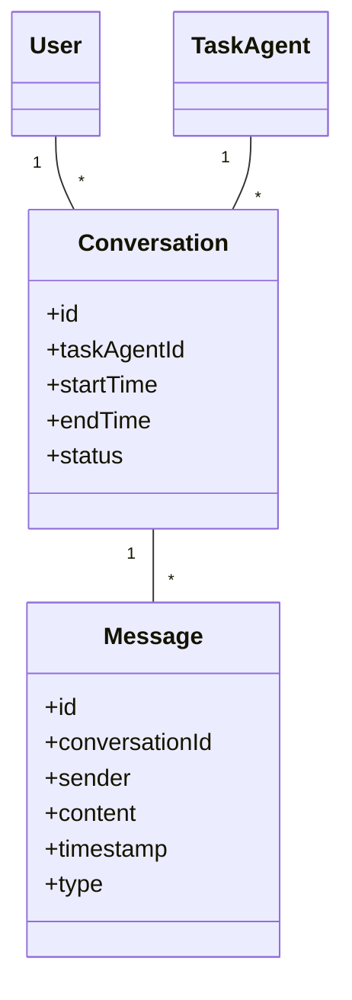
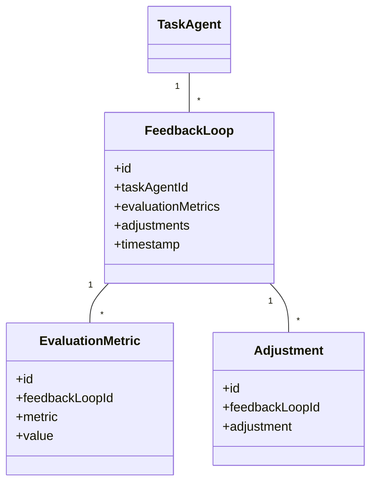

# マルチLLM APIダッシュボード ユースケースとモデリング

## 1. ユースケース図

```mermaid
graph TD
    User((ユーザー))
    Admin((管理者))
    
    User --> Login[ログイン]
    User --> CreateProject[プロジェクト作成]
    User --> CreateTaskAgent[タスクエージェント作成]
    User --> ExecuteTask[タスク実行]
    User --> ViewResults[結果閲覧]
    User --> ManageAPI[API管理]
    User --> ViewProjectDetails[プロジェクト詳細]
    User --> EditProject[プロジェクト編集]
    User --> DeleteProject[プロジェクト削除]
    User --> ViewTaskAgentDetails[タスクエージェント詳細]
    User --> EditTaskAgent[タスクエージェント編集]
    User --> DeleteTaskAgent[タスクエージェント削除]
    User --> StartConversation[会話開始]
    User --> SendMessage[メッセージ送信]
    User --> ViewFeedback[フィードバック閲覧]
    User --> ProvideFeedback[フィードバック提供]
    
    Admin --> ManageUsers[ユーザー管理]
    Admin --> MonitorSystem[システム監視]
    Admin --> ManageAPIProviders[APIプロバイダ管理]
    
    subgraph ダッシュボード
        CreateProject
        CreateTaskAgent
        ExecuteTask
        ViewResults
        ManageAPI
    end
```



## 2. ドメインモデル



## 3. シーケンス図（タスク実行）

```mermaid
sequenceDiagram
    actor User
    participant Frontend
    participant Backend
    participant LLM_API
    participant Database
    
    User->>Frontend: タスク実行リクエスト
    Frontend->>Backend: タスク実行API呼び出し
    Backend->>Database: タスクエージェント取得
    Database-->>Backend: タスクエージェント情報
    Backend->>Backend: サブステップ分割
    loop 各サブステップ
        Backend->>LLM_API: API呼び出し
        LLM_API-->>Backend: 結果
        Backend->>Backend: 結果処理
    end
    Backend->>Database: 実行結果保存
    Backend-->>Frontend: 実行完了通知
    Frontend-->>User: 結果表示
    note "エラーハンドリング"
    Backend->>Frontend: エラーメッセージ
    Frontend-->>User: エラーメッセージ表示
```

## 4. ER図



## 5. コンVERSATIONモデル



## 6. フィードバックループモデル



これらの図表は、マルチLLM APIダッシュボードのシステム構造と動作を視覚的に表現しています。