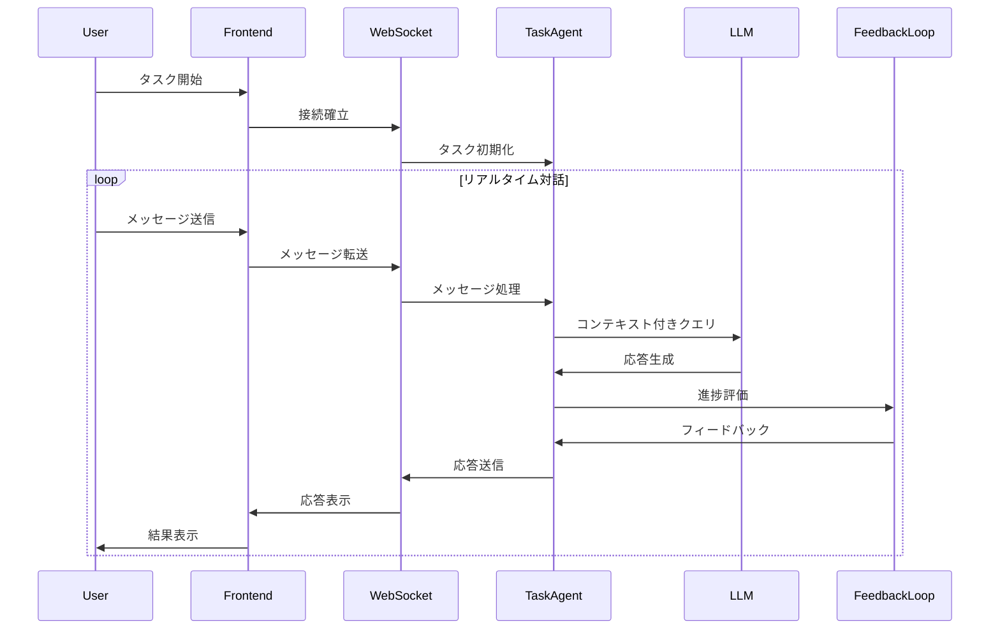
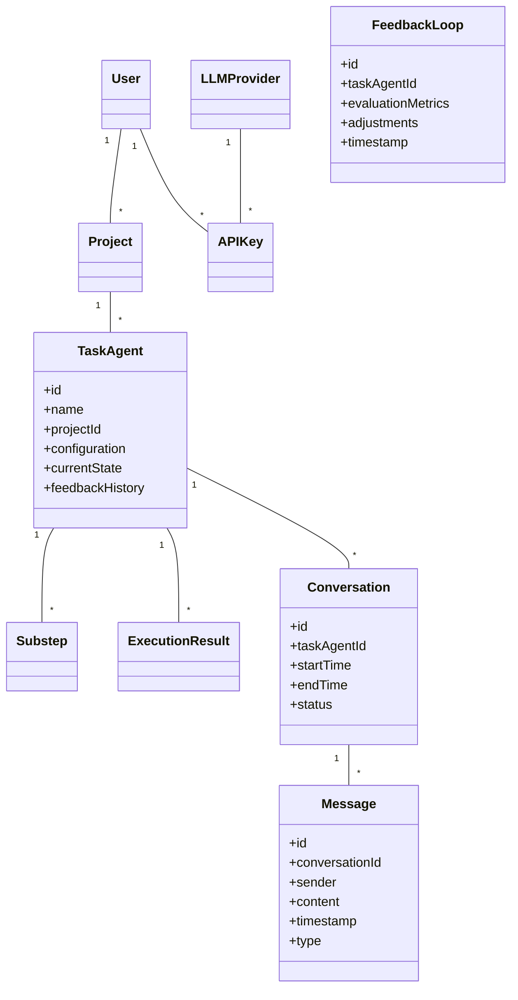

# リアルタイム対話型マルチLLM APIダッシュボード アーキテクチャ設計

## 1. システム概要

このシステムは、ユーザーがリアルタイムでタスクエージェントと対話しながら、自律的にフィードバックループを回してタスクを遂行する機能を提供します。

## 2. アーキテクチャ設計

### 2.1 全体構成

- フロントエンド: Remix.js + Tailwind CSS + shadcn/ui
- バックエンド: Remix.js (loader/action) + Prisma + WebSocket
- 主要データベース: PostgreSQL
- リアルタイム通信: WebSocket (Socket.io)
- タスク管理: Apache Kafka
- LLMインテグレーション: LangChain
- 環境変数管理: Secret Manager
- 認証: Firebase Authentication
- インフラ: GCP (Cloud Run, Cloud SQL, Vertex AI)

### 2.2 コンポーネント説明

1. **リアルタイム対話エンジン**:
   - WebSocketを使用したリアルタイム双方向通信
   - ユーザーとタスクエージェント間のメッセージングシステム

2. **自律的フィードバックループ**:
   - LangChainを使用したタスク���捗の自動評価
   - フィードバックに基づくタスク調整メカニズム

3. **タスク実行オーケストレーター**:
   - Kafkaを使用したタスクの分散処理
   - マイクロサービスアーキテクチャによる柔軟なタスク実行

4. **適応型LLMセレクター**:
   - タスクの性質に応じた最適なLLMの動的選択
   - マルチLLM統合による相補的な処理

## 3. リアルタイム対話フロー

## 4. 自律的フィードバックループ

1. **進捗モニタリング**:
   - タスクの各ステップの完了状況を追跡
   - 予定と実際の進捗の差異を分析

2. **品質評価**:
   - LLMを使用した出力の品質チェック
   - ユーザーフィードバックの収集と分析

3. **自動調整**:
   - 進捗と品質に基づくタスク戦略の動的調整
   - 必要に応じたサブタスクの追加または修正

4. **学習と最適化**:
   - 成功パターンの学習と将来のタスクへの適用
   - 継続的なパフォーマンス改善メカニズム

## 5. 拡張されたデータモデル

## 6. パフォーマンスと拡張性

1. **非同期処理**:
   - WebSocketとKafkaを使用した非ブロッキング処理
   - 長時間実行タスクのバックグラウンド処理

2. **マイクロサービスアーキテクチャ**:
   - タスク実行を独立したマイクロサービスに分割
   - サービス間の疎結合による柔軟なスケーリング

3. **キャッシュ戦略**:
   - Redisを使用した頻繁にアクセスされるデータのキャッシング
   - LLM応答のキャッシングによる重複クエリの削減

4. **負荷分散**:
   - Cloud Runの自動スケーリングを活用
   - 地理的に分散したデプロイメント

## 7. セキュリティとプライバシー

1. **エンドツーエンド暗号化**:
   - WebSocket通信の暗号化
   - 保存データの暗号化

2. **認証と認可**:
   - Firebase Authenticationによる強固な認証
   - きめ細かなアクセス制御ポリシー

3. **データ最小化**:
   - 必要最小限の個人情報のみを処理
   - 定期的なデータクレンジング

## 8. モニタリングと分析

1. **リアルタイムダッシュボード**:
   - タスク進捗のリアルタイム可視化
   - システムパフォーマンスメトリクスの表示

2. **高度な分析**:
   - 機械学習を使用したタスクパターンの分析
   - 予測的メンテナンスのためのアノマリー検出

3. **ログとトレーシング**:
   - 分散トレーシングによる詳細なシステム動作の把握
   - 構造化ログによる効率的なトラブルシューティング

この新しいアーキテクチャにより、ユーザーはリアルタイムでタスクエージェントと対話しながら、システムが自律的にフィードバックループを回してタスクを最適化し遂行することが可能になります。