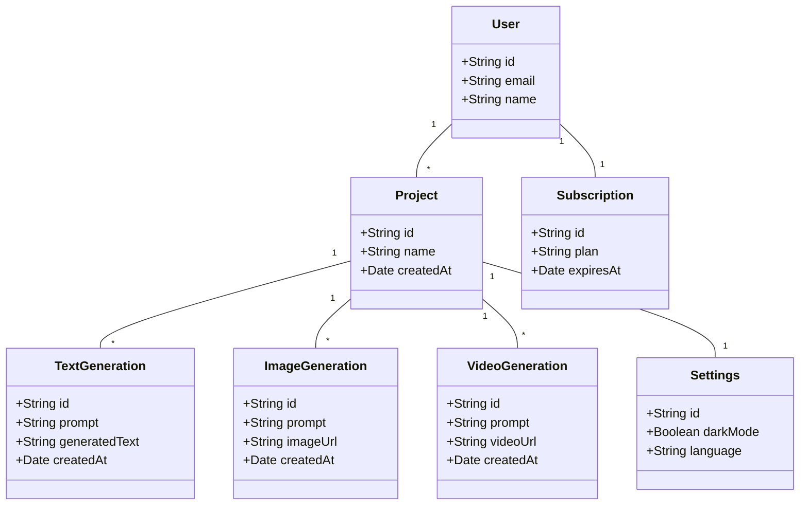
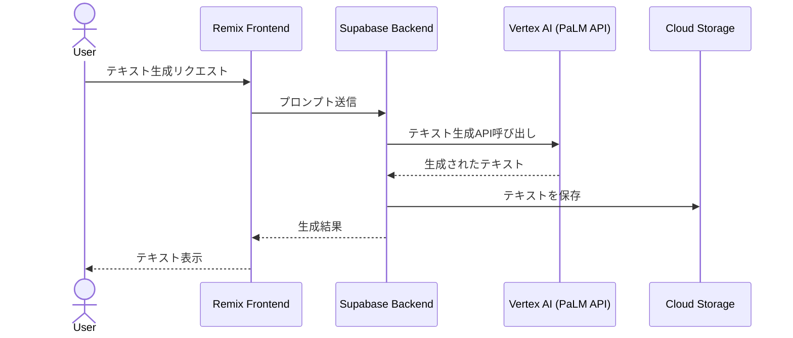
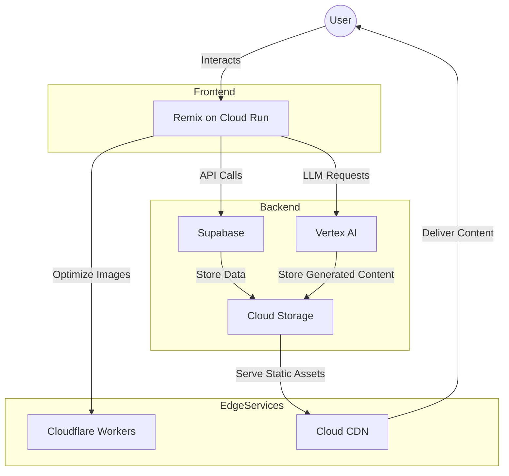

# ADR: 包括的なLLMアプリケーションアーキテクチャ

## ステータス

提案済み

## コンテキスト

個人向けの包括的なLLMアプリケーションを構築するにあたり、テキスト生成、画像生成、動画生成機能を備えたダッシュボードの開発が求められています。既存のアーキテクチャ案（Supabase as BaaS、Terraform on GCP、Cloudflare Workers with Remix）を考慮し、最適なアプローチを決定する必要があります。

## 決定

Remixをフロントエンドフレームワークとして使用し、バックエンドにはSupabaseを採用、インフラストラクチャはGCP上にTerraformで構築し、一部の機能をCloudflare Workersで補完するハイブリッドアーキテクチャを採用します。

## アーキテクチャ概要

1. **フロントエンド (Remix)**:
   - GCP Cloud Run上で動作
   - ユーザーインターフェース（ダッシュボード）の提供
   - サーバーサイドレンダリングとクライアントサイド機能の組み合わせ

2. **バックエンド (Supabase)**:
   - PostgreSQLデータベース
   - 認証・認可
   - リアルタイムサブスクリプション
   - ストレージ（ユーザーデータ、生成コンテンツ）

3. **LLMサービス**:
   - テキスト生成: Vertex AI (PaLM API)
   - 画像生成: Vertex AI (Imagen)
   - 動画生成: 

4. **インフラストラクチャ (GCP + Terraform)**:
   - Cloud Run: Remixアプリケーションのホスティング
   - Cloud Storage: 静的アセットと生成コンテンツの保存
   - Cloud CDN: コンテンツ配信の最適化
   - Cloud Monitoring: アプリケーションの監視

5. **補完機能 (Cloudflare Workers)**:
   - エッジでの画像処理・最適化
   - グローバルな低レイテンシーアクセス

## ユースケース

1. テキスト生成ダッシュボード
2. 画像生成ワークスペース
3. 動画生成プロジェクト管理
4. コンテンツライブラリ管理
5. ユーザー設定と課金管理

## ドメインモデリング

## シーケンス図（テキスト生成の例）

## アーキテクチャモデリング

## 技術的考慮事項

1. **認証とセキュリティ**:
   - SupabaseのJWTトークンをRemixセッションに保存
   - Cloud Identity Platformとの統合も検討

2. **パフォーマンス最適化**:
   - Remixのサーバーサイドレンダリングを活用
   - Cloudflare WorkersでのJust-in-Time画像最適化

3. **スケーラビリティ**:
   - Cloud Runの自動スケーリング機能を活用
   - Supabaseのコネクションプーリングを適切に設定

4. **開発者体験**:
   - Terraformを使用したインフラのコード化
   - Supabase CLIを使用したローカル開発環境のセットアップ

5. **コスト管理**:
   - GCPリソースの使用量制限をTerraformで設定
   - Supabaseの適切なプラン選択

## 利点

- 高性能かつスケーラブルなアーキテクチャ
- マネージドサービスの活用による運用負荷の軽減
- グローバルな低レイテンシーアクセスの実現
- 柔軟な機能拡張性

## 欠点

- 複数のサービスの組み合わせによる複雑性の増加
- 各サービスの学習コスト
- 潜在的なベンダーロックインリスク

## 参考リンク

- [Remix Documentation](https://remix.run/docs/en/v1)
- [Supabase Documentation](https://supabase.com/docs)
- [Google Cloud Platform Documentation](https://cloud.google.com/docs)
- [Terraform GCP Provider Documentation](https://registry.terraform.io/providers/hashicorp/google/latest/docs)
- [Cloudflare Workers Documentation](https://developers.cloudflare.com/workers/)

## 結論

この包括的なLLMアプリケーションアーキテクチャは、Remix、Supabase、GCP、およびCloudflare Workersの長所を組み合わせることで、高性能で拡張性の高い個人向けダッシュボードの構築を可能にします。Terraformを用いたインフラストラクチャの管理により、再現性と保守性が向上します。ただし、複数のサービスを統合する複雑性と、各技術の学習コストについては慎重に評価し、適切に管理する必要があります。