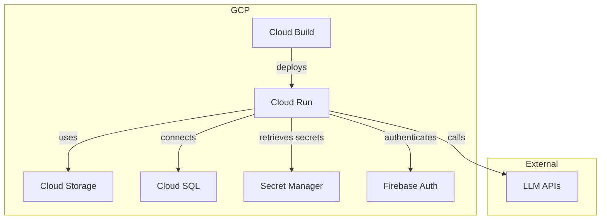

# Terraform Design Document for Multi-LLM API Dashboard on GCP

## 1. 概要

このドキュメントでは、マルチLLM APIダッシュボードのGCP上でのインフラストラクチャをTerraformを使用して構築するためのデザインを詳述します。

## 2. アーキテクチャ概要



## 3. Terraformモジュール構成

```
terraform/
├── modules/
│   ├── cloud_run/
│   ├── cloud_sql/
│   ├── cloud_storage/
│   ├── secret_manager/
│   ├── firebase_auth/
│   └── cloud_build/
├── environments/
│   ├── dev/
│   ├── staging/
│   └── prod/
└── main.tf
```

## 4. 主要リソース

### 4.1 Cloud Run (modules/cloud_run)

- Remixフロントエンドとバックエンドを統合したコンテナをデプロイ
- オートスケーリングの設定
- カスタムドメインの設定

### 4.2 Cloud SQL (modules/cloud_sql)

- PostgreSQLインスタンスの作成
- データベースとユーザーの設定
- バックアップ設定

### 4.3 Cloud Storage (modules/cloud_storage)

- 静的アセット用のバケット
- ユーザーアップロードファイル用のバケット

### 4.4 Secret Manager (modules/secret_manager)

- LLM API キーの管理
- データベース認証情報の管理

### 4.5 Firebase Authentication (modules/firebase_auth)

- Identity Platformプロジェクトの設定
- 認証プロバイダーの設定

### 4.6 Cloud Build (modules/cloud_build)

- CI/CDパイプラインの設定
- ビルドトリガーの作成

## 5. 変数設定

各環境（dev, staging, prod）ごとに以下の変数を設定:

- プロジェクトID
- リージョン
- Cloud Run インスタンス数
- Cloud SQL インスタンスタイプ
- ストレージバケット名
- ドメイン名

## 6. セキュリティ考慮事項

- VPCネットワークの設定
- Cloud SQLへのプライベートアクセスの設定
- IAMロールと権限の最小権限原則に基づく設定
- Secret Managerへのアクセス制御

## 7. スケーラビリティ

- Cloud Runのオートスケーリング設定
- Cloud SQLの読み取りレプリカの設定（必要に応じて）
- Cloud Storageのマルチリージョン設定

## 8. コスト最適化

- Cloud Runの最小インスタンス数の設定
- Cloud SQLのインスタンスタイプの適切な選択
- 長期保存データのCold Storageへの移行設定

## 9. 監視とロギング

- Cloud Monitoringのアラート設定
- Cloud Loggingの設定
- カスタムダッシュボードの作成

## 10. ディザスタリカバリ

- Cloud SQLの定期バックアップ設定
- 異なるリージョンへのレプリケーション設定

## 11. CI/CD統合

- GitHub ActionsとCloud Buildの連携設定
- 環境ごとのデプロイメントパイプラインの設定

## 12. テスト戦略

- Terraformプランのテスト自動化
- インフラストラクチャテストの実装（例：Terratest）

## 13. ドキュメンテーション

- 各モジュールのREADME.mdの作成
- 変数とアウトプットの詳細なドキュメント化

## 14. 今後の拡張性

- 新しいLLM APIの追加に対応できる柔軟な設計
- マルチリージョンデプロイメントへの対応準備

## 15. 制約と依存関係

- GCPプロジェクトの事前作成が必要
- Terraform実行用のサービスアカウントに必要な権限の付与が必要

## 16. リスクと軽減策

- 状態ファイルの管理：Cloud Storageでのリモート状態管理を使用
- 誤った変更の防止：Terraform Cloudでのワークスペース管理とアプルーバルプロセスの導入

## 17. タイムライン

1. 基本インフラストラクチャのTerraform化（3日）
2. モジュール化と再利用可能なコンポーネントの作成（2日）
3. 環境ごとの設定とテスト（1日）
4. CI/CD統合とデプロイメント自動化（1日）

合計：1週間

## 18. 承認とレビュープロセス

1. アーキテクチャレビュー
2. セキュリティレビュー
3. コストレビュー
4. 最終承認

## 19. 参考リンク

- [Terraform GCP Provider Documentation](https://registry.terraform.io/providers/hashicorp/google/latest/docs)
- [GCP Terraform Examples](https://github.com/terraform-google-modules)
- [Terraform Best Practices](https://www.terraform-best-practices.com/)
